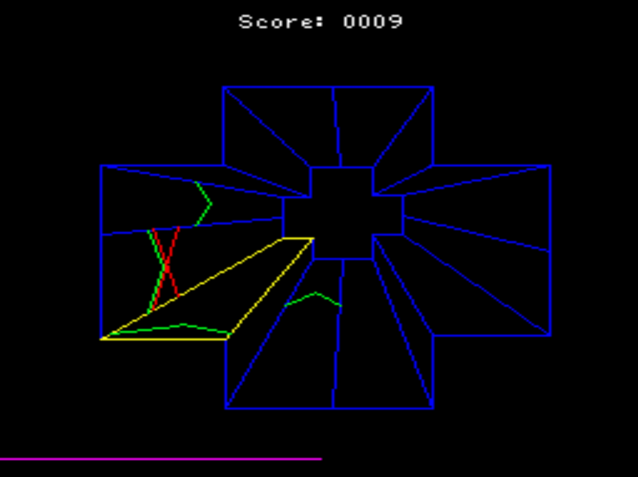

# Démos pour ordinateur Squale

Quelques petits programmes pour l'ordinateur Squale de la société Apollo 7, un micro-ordinateur français [sorti en 1985](https://www.acbm.com/virus/num_46/25881_Squale_la_surprenante_histoire_de_l_ordinateur_francais_qui_n_a_soi-disant_jamais_ete_commercialise.html). Elle sont inspirées de [la démonstration MO5.com de Jean-François DEL NERO](https://github.com/jfdelnero/Apollo_7_Squale). Etant donné que je n'ai pas réussi à recompiler cette démo (écrite en C), ces démos sont écrits en assembleur 6809 et assemblés avec le [c6809 d'OlivierP-To8](https://github.com/OlivierP-To8/BootFloppyDisk/tree/main/tools)

## Démos

- `texte.rom`: affichage texte (utiliser les flèches pour agrandir/rétrécir le texte)
- `temps_pourri.rom`: en hommage à l'origine bretonne du Squale
- `olipix.rom`: en hommage à un fan des ordinateurs obscures

Pour lancer sur l'émulateur MAME:

- Lancer le noyau Squale
- Appuyez sur Home (ou Del sur macOS) pour activer les raccourcis clavier MAME
- Appuyez sur Tab pour lancer le menu
- File Manager / cartridge
- Sélectionnez le fichier .rom désiré

## Comment fonctionne la démo Olipix

Le Squale a comme processeur graphique le Thomson EF 9365, qui ne permet que d'afficher que du texte et des lignes - aucune bitmap (voire la section [API](API.md)). L'image de base a été convertie en données binaires par l'utilitaire [bmp2vect](https://github.com/jfdelnero/Apollo_7_Squale/tree/master/examples/Squale_Technical_Demo/bmp2vect). Elle est encodée comme une série de vecteurs horizontaux, chaque ligne de l'image étant composée d'un ou plusieurs vecteurs.

La routine [DRAW_BITMAP](olipix.asm#L145) dessine l'image à l'écran. C'est une conversion en assembleur 6809 de la function C [display_vectsprite()](https://github.com/jfdelnero/Apollo_7_Squale/blob/master/examples/Squale_Technical_Demo/deuxd_func.c#L124). L'effet de transparence est obtenu comme çi: lorsqu'une ligne noire doit être dessinée, le programme regarde alors la hauteur Y de la ligne. Si cette dernière est à $80, $70 ou $50 (la hauteur des lignes du fond), la ligne est dessinée en bleu au lieu de noir.

Documents:

- [Code de l'implémentation MAME du Thomson EF 9365](https://github.com/mamedev/mame/blob/master/src/devices/video/ef9365.cpp)
- [Noyau MAME du Squale](https://github.com/mamedev/mame/blob/master/src/mame/skeleton/squale.cpp)

## Générer une cartouche

La cartouche est générée par `buildrom.py` et contient deux parties:

- Un loader (0x0000-0x0100)
- Le programme même (0x0100-0x8000)

Le Loader est chargé par le Squale à l'adresse $C100 en mémoire. Son but est de copier le reste du contenu de la cartouche à l'adresse $0000 (la cartouche n'est pas accessible directement, mais en lisant continuellement l'adresse $F048). Un fois l'opération terminée, il exécute le code à l'adresse $0000.
